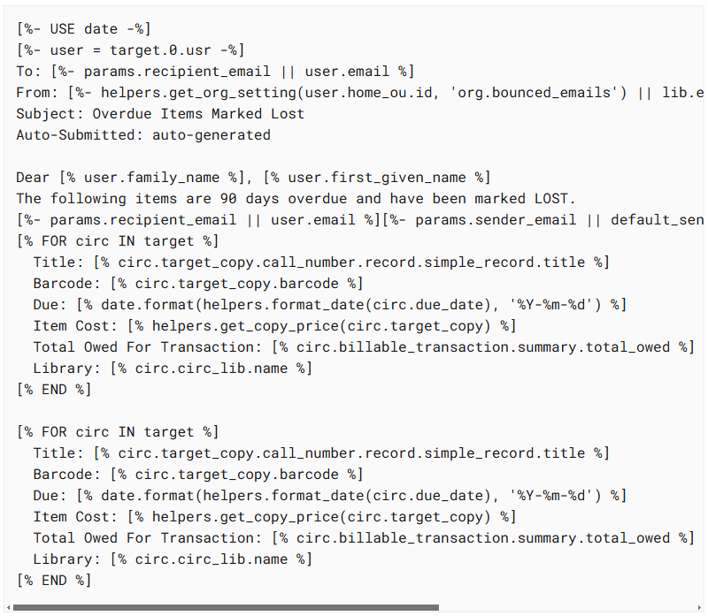
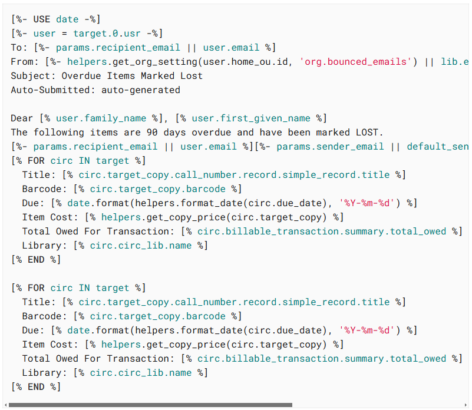

# tt2-highlight.js

TT2 syntax highlighter for `highlight.js`. Designed for use on the Evergreen ILS docs site, which is an Antora documentation site. Evergreen uses many TT2 files as templates for generating dynamic pages, but there is no native syntax highlighting for it in `highlight.js`. This is my attempt to remedy that.

## Overview

This project provides a custom syntax highlighter for TT2 (Template Toolkit) files, which are commonly used in the Evergreen ILS project. The highlighter is implemented in [highlight.js](highlight.js).

## Features

- Highlights TT2 Pseudo-Perl syntax, including:
  - Line comments (`#` or `##`)
  - Single and double quoted strings
  - Numbers
  - Function calls with optional dot-chaining
  - Variables with or without a leading `$`
  - Bare identifiers that are not recognized as keywords or function calls

- Integrates with `highlight.js` to provide syntax highlighting within TT2 blocks in HTML/XML files.

## Usage

To use this highlighter, register the custom languages `tt2-pseudoperl` and `tt2` with `highlight.js` as shown in [highlight.js](highlight.js).

Then add a tt2 block to your docs site, like this:

```adoc
[source,tt2]
----
[% IF foo %]
  [% foo.bar %]
[% END %]
----
```

## Example

```js
hljs.registerLanguage('tt2-pseudoperl', function (hljs) {
  // Custom TT2 Pseudo-Perl highlighter implementation
});

hljs.registerLanguage('tt2', function () {
  // Custom TT2 highlighter implementation
});
```

## Before and After

Before:

<div style="max-width: 600px;">
  
</div>

After:

<div style="max-width: 600px;">
  
</div>